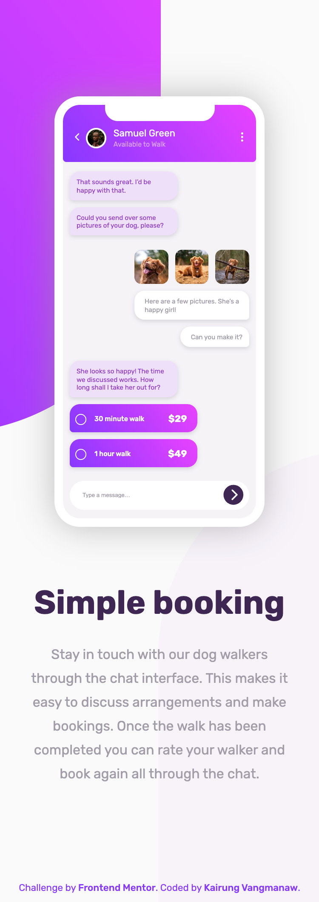
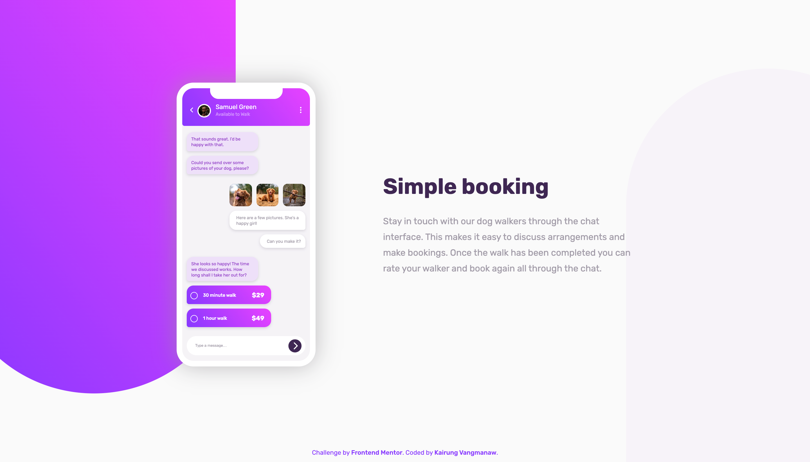

# Frontend Mentor - Chat app CSS illustration solution

This is a solution to the [Chat app CSS illustration challenge on Frontend Mentor](https://www.frontendmentor.io/challenges/chat-app-css-illustration-O5auMkFqY). Frontend Mentor challenges help you improve your coding skills by building realistic projects. 

## Table of contents

- [Frontend Mentor - Chat app CSS illustration solution](#frontend-mentor---chat-app-css-illustration-solution)
  - [Table of contents](#table-of-contents)
  - [Overview](#overview)
    - [The challenge](#the-challenge)
    - [Screenshot](#screenshot)
    - [Links](#links)
  - [My process](#my-process)
    - [Built with](#built-with)
    - [What I learned](#what-i-learned)
    - [Continued development](#continued-development)
    - [Useful resources](#useful-resources)
    - [AI Collaboration](#ai-collaboration)
  - [Author](#author)
  - [Acknowledgments](#acknowledgments)

## Overview

### The challenge

Users should be able to:

- View the optimal layout for the component depending on their device's screen size
- **Bonus**: See the chat interface animate on the initial load

### Screenshot

  
Mobile view

  

  
Desktop view

  

### Links

- Solution URL: [Responsive Chat App with React & Fluid CSS Clamp Positioning](https://www.frontendmentor.io/solutions/chat-app-css-illustration-with-react-and-sass-o8dRc3eBpR)
- Live Site URL: [Frontend Mentor | Chat App CSS Illustration](https://challenged-by-frontend-mentor.github.io/chat-app-css-illustration/)

## My process

### Built with

- Semantic HTML5 markup
- CSS custom properties
- Flexbox
- Mobile-first workflow
- BEM Naming Methodology
- CSS clamp() function
- [React](https://react.dev/) - JS library for building component-based UI
- [Vite](https://vitejs.dev/) - Next Generation Frontend Tooling
- [React Icons](https://react-icons.github.io/react-icons/) - For clean UI icons

### What I learned

In this project, I deepened my understanding of fluid responsive design without over-relying on standard media queries for every single breakpoint. Key takeaways include:

- **Fluid Layouts with `clamp()`:** Learning how to calculate linear interpolation to scale pixel values smoothly across viewports (from 375px to 1440px). This helped solve layout bugs where absolute background shapes would drift off-screen on larger monitors.

- **Complex CSS Shapes & Gradients:** Mastering custom `border-radius` combinations (e.g., `border-bottom-right-radius: 50% 35%`) alongside multi-stop linear gradients to replicate the design mockup accurately.

- **Clean React Architecture:** Structuring reusable components cleanly and ensuring proper JSX attributes (like passing booleans correctly to `readOnly` attributes) and accessibility guidelines.

### Continued development

Moving forward, I want to continue refining my approach to responsive design:

- **Refining Position Strategies:** Exploring alternative methods for positioning background assets, such as using `left: 50%` combined with `transform: translateX()` relative to a container, to see if it provides better stability than absolute pixel offsets.

- **CSS Architecture:** Keeping CSS clean, modular, and maintainable as projects scale.

- **Advanced Accessibility:** Ensuring all interactive components and custom UI elements are fully accessible via keyboard and screen readers.

### Useful resources

- [MDN - CSS Gradient Reference](https://developer.mozilla.org/en-US/docs/Web/CSS/Reference/Values/gradient) - Great reference for understanding CSS gradient types.
- [MDN - linear-gradient()](https://developer.mozilla.org/en-US/docs/Web/CSS/Reference/Values/gradient/linear-gradient) - Helped with creating smooth background gradients.
- [MDN - border-bottom-right-radius](https://developer.mozilla.org/en-US/docs/Web/CSS/Reference/Properties/border-bottom-right-radius) - Essential for creating elliptical curve shapes.
- [CSS Gradient Generator](https://cssgradient.io/) - Useful visual tool for tweaking gradient colors and angles.
- [CSS-Tricks - Multiple Class / ID Selectors](https://css-tricks.com/multiple-class-id-selectors/) - Great refresher on selector specificity and combinations.
- [Atmos - RGB to HSL Converter](https://atmos.style/color-converter/rgb-to-hsl) - Handy tool for converting color formats to match design tokens.

### AI Collaboration

- **Google Gemini & Google Search AI Mode:** Used as a thoughtful partner for troubleshooting CSS layout behaviors, deriving linear equations for `clamp()`, and reviewing React code for best practices and accessibility improvements.

## Author

- GitHub: [Kairung Vangmanaw](https://github.com/VangmanawKairung)
- Frontend Mentor - [@VangmanawKairung](https://www.frontendmentor.io/profile/VangmanawKairung)

## Acknowledgments

Huge thanks to myself for pushing through, and to my family for their endless support. I’m deeply grateful to Frontend Mentor for another great challenge, and to Apple for macOS Preview, which made inspecting exact pixel values effortless without Figma. 

Special thanks to Chrome DevTools, VS Code, Gemini, and Google Search AI Mode for being invaluable companions throughout the build process.